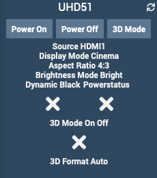

Plugin Optoma
=============

Este complemento monitorea y controla el iPhone / iPad de Apple.

> ** Nota **
> Primero, debe instalar el ajuste OpenSSH en su dispositivo.

** Funcionalidad: **

- Prender apagar,
- mostrar información de hardware,
- desbloquear el dispositivo,
- Inicie aplicaciones de forma remota.

**Compatibilidad**
- Todos los iPad/iPhone

Tablero
=========

Configuración del complemento
=======================

Primero descargue el complemento, luego actívelo.

Configuración del equipo
=============================

Se puede acceder a la configuración del equipo mediante Menú *Complementos> Monitoreo> Jailbreak*.

### Equipo de pestañas:

- **Nombre del equipo**: nombre de su equipo,
- **Objeto padre**: indica el objeto padre al que pertenece el equipo,
- **Categoría**: las categorías del equipo (puede pertenecer a varias categorías),
- **Activar**: para activar su equipo,
- **Visible**: hace que su equipo sea visible en el tablero,
- **Dirección IP**: dirección IP del equipo,
- **Dirección del puerto SSH**: puerto SSH del equipo (instale OpenSSH Tweak en el dispositivo),
- **Inicio de sesión**: inicio de sesión SSH (predeterminado: raíz),
- **Contraseña**: contraseña SSH asociada con el inicio de sesión (predeterminado: alpine).

### Comandos de pestañas

Los comandos se crean automáticamente.

### Registro de cambios

*[Ver registro de cambios](changelog.md) *
